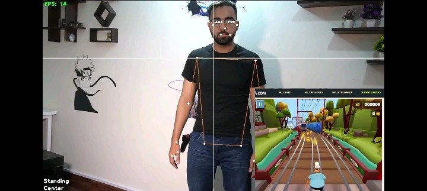

# Playing Subway Surfers Game with Body Gestures

This project integrates pose detection using MediaPipe to control movements in the Subway Surfers game. Users can interact with the game using their body movements detected through a camera.

<div align="center">

</div>

## Table of Contents

- [Introduction](#introduction)
- [Functionality](#functionality)
- [How It Works](#how-it-works)
- [Requirements](#requirements)
- [Usage](#usage)


## Introduction

Welcome to the Subway Surfers Pose Detection project! This innovative application brings a new level of interactivity to the classic Subway Surfers game by allowing players to control the game using their body movements captured through a camera. Leveraging the power of pose detection technology provided by MediaPipe, this project offers an immersive gaming experience where players can jump, dodge, and slide in the game world simply by moving in front of their webcam. With intuitive controls and seamless integration, Subway Surfers Pose Detection opens up a whole new dimension of gameplay, merging the virtual and physical worlds in an exciting and engaging way.


## Functionality

- **ImagePreprocessing Class (image_processing.py)**: Handles image preprocessing tasks such as getting initial shoulder coordinates, drawing lines on the frame, calculating distances, and checking for hands joined, left-right movement, and up-down movement.

- **App Class (app.py)**: Inherits functionalities from ImagePreprocessing class and implements the main application logic. It captures video frames, processes them for pose detection, and simulates keyboard inputs based on detected movements to control the Subway Surfers game.

## How It Works

The application works by capturing video frames from the webcam, processing them using pose detection algorithms, and interpreting the detected poses to control the Subway Surfers game. Here's how it works:

1. **Image Preprocessing**: The `src/image_processing.py` script preprocesses each frame to detect poses and analyze movements.
   
2. **Pose Detection**: The application uses the MediaPipe library to detect key body landmarks such as shoulders, wrists, and joints in each frame.
   
3. **Interpreting Movements**: Based on the detected poses, the application determines the player's movements, such as whether their hands are joined, if they are moving left, right, up, or down.

4. **Controlling the Game**: Using PyAutoGUI, the application simulates keyboard inputs (such as pressing the spacebar, arrow keys) to control the Subway Surfers game, translating the detected movements into in-game actions.

## Requirements

Before running the scripts, ensure you have the following dependencies installed:

- Python 3.x
- OpenCV
- MediaPipe
- PyAutoGUI

## Usage

1. Clone the repository:
   ```
   git clone https://github.com/amromeshref/Subway-Surfers-Game-with-Body-Gestures.git
   ```

1. Navigate to the project directory
   ```
   cd Subway-Surfers-Game-with-Body-Gestures
   ```
1. Install the required dependencies using pip:
   ```
   pip install -r requirements.txt
   ```

1. Run the application:
   ```
   python3 app.py
   ```
